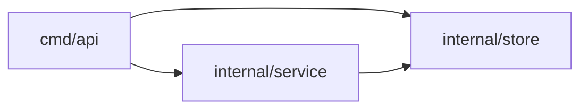

Combines all 10 archetype PRs plus 4 new subsystems. Please review carefully — this is a large PR.

<!-- ZREVIEW:BEGIN -->
## Automated review by zreview

### Reviewer effort

**🔴 10 / 10 — heavy**

How this was calculated

| Signal | Detail | Contribution |
| --- | --- | --- |
| Base |  | +0.50 |
| LOC churn | +990 / −0 (990 lines) | +2.50 (cap) |
| Files changed | 40 file(s) | +1.50 (cap) |
| New files | 40 new | +1.50 (cap) |
| Largest single file | 58 lines in internal/legacy/cache.go | +0.17 |
| Auth path touched | internal/auth/middleware.go (+3 more) | +1.50 |
| Migration path touched | internal/db/migrations/003_add_user_email.sql | +1.50 |
| Overlapping PRs | 4 other PR(s) | +1.50 (cap) |
| Findings | 3 CRIT / 5 HIGH / 4 MED / 0 LOW | +4.00 (cap) |

_Reproducible: same diff → same score. Weights configurable via `.zreview/effort.yaml` or `$ZREVIEW_EFFORT_POLICY`._

This pull request introduces a new service architecture along with session management and user handling features. It also includes a price handler for an HTTP server and various utility functions for handling data and errors.

### Package imports (parsed from source)

### Potential overlap with other PRs

> **⚠️ Potential overlap with other open PRs** — these may be stepping on this one:
>
> - [#9](https://github.com/shubam-disseqt/zreview-e2e-matrix/pull/9) (merge-conflict risk) — Both PRs modify the same legacy subsystem files. Shared: internal/legacy/cache.go, internal/legacy/config.go, internal/legacy/http.go +7 more
> - [#3](https://github.com/shubam-disseqt/zreview-e2e-matrix/pull/3) (merge-conflict risk) — Both PRs modify the same auth middleware and session files. Shared: internal/auth/middleware.go, internal/auth/session.go
> - [#4](https://github.com/shubam-disseqt/zreview-e2e-matrix/pull/4) (merge-conflict risk) — Both PRs modify cmd/api/wire.go and service files. Shared: cmd/api/wire.go, internal/service/service.go, internal/service/service_test.go +1 more
> - [#5](https://github.com/shubam-disseqt/zreview-e2e-matrix/pull/5) (merge-conflict risk) — Both PRs modify the same user-related database files. Shared: internal/db/migrations/003_add_user_email.sql, internal/db/user.go, internal/db/user_validate.go

| Severity | Count |
| --- | --- |
| CRITICAL | 3 |
| HIGH | 5 |
| MEDIUM | 4 |
| LOW | 0 |

**Risk:** `risk/critical` — medium: The introduction of session management and user handling features may introduce security vulnerabilities if not properly validated.

### Change groups

- **Service and Session Management** — This group of changes implements a new service structure that interacts with a session store for user management. It includes middleware for authentication and session validation, as well as tests for the service's fetch functionality. (cmd/api/wire.go, internal/service/service.go, internal/service/service_test.go, internal/session/store.go, internal/auth/middleware.go, internal/auth/session.go)
- **Database and User Management** — This section adds a database migration to include an email field in the user table, along with user-related functionalities and validation methods. It also introduces a search function for users based on their names. (internal/db/migrations/003_add_user_email.sql, internal/db/user.go, internal/db/user_validate.go, internal/search/query.go)
- **File Handling and Legacy Code** — This part of the PR includes file handling capabilities and a significant amount of legacy code that manages user sessions, logging, and configuration. It also includes a simple FIFO queue implementation and a retry mechanism. (internal/files/download.go, internal/legacy/*.go)
- **Utility Functions** — This group introduces various utility functions for handling common tasks such as mathematical operations, string manipulations, and error handling. These functions are designed to simplify code and improve reusability. (internal/pkgutil/*.go, internal/mathx/*.go)
- **Pricing Handler** — This change adds a pricing handler that serves item prices over HTTP. It includes input validation and error handling for the price retrieval process. (pricing.go)

### Testing notes

Reviewers should test the new service by running the application and accessing the price endpoint at '/price' with various query parameters. Additionally, ensure that the session management and user fetching functionalities work as expected.
<!-- ZREVIEW:END -->
